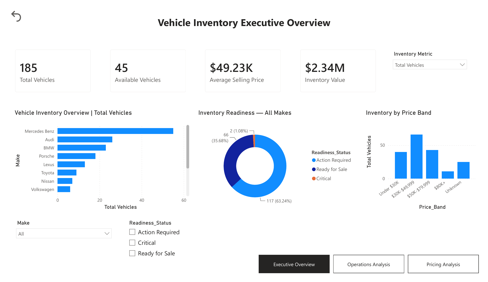
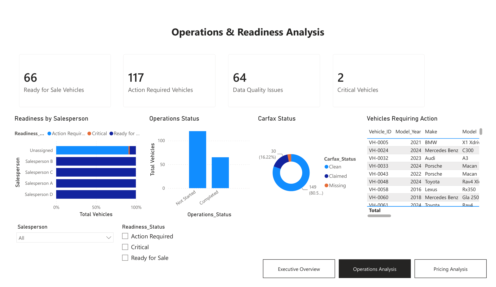
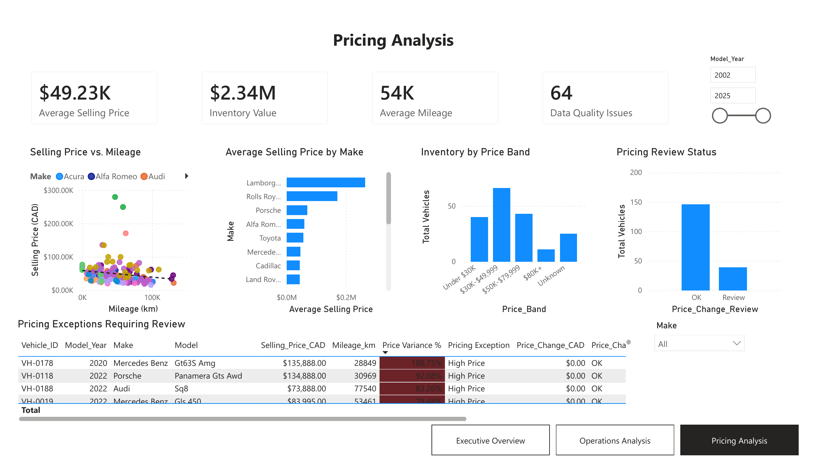
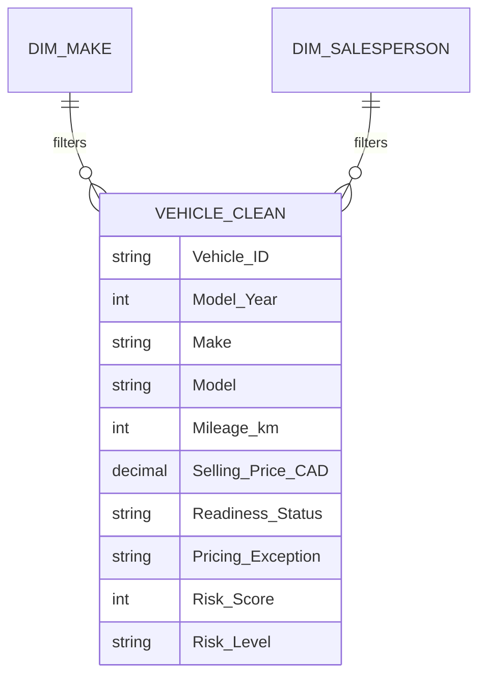

# Used Vehicle Inventory & Operations Analytics

**Power BI | Power Query | DAX | SQL | Data Modeling**

An end-to-end business intelligence portfolio project that transforms a real-world used-vehicle inventory workflow into an interactive decision-support solution for inventory, operations readiness, pricing review, data quality, and vehicle-level follow-up.

> **Privacy note:** The original operational workbook is intentionally excluded from this repository. Employee identifiers and full VINs were anonymized during transformation, and the public repository contains documentation rather than the original row-level source data.

## Dashboard Preview



The report snapshot contains **185 vehicle records**, including **45 available vehicles**, approximately **$2.34M in available inventory value**, and an **average selling price of $49.23K**. The readiness view identifies **117 vehicles requiring action**, **66 ready for sale**, and **2 critical vehicles**. These values reflect the dashboard snapshot exported with the project. 

## Business Problem

The source process maintained vehicle inventory, pricing, documentation, preparation status, and assignment information in an operational Excel workbook. The workbook was useful for day-to-day work but was not designed for management reporting or analytical decision-making.

The project converts that operational data into a reusable analytical model that helps answer questions such as:

- How much inventory is currently available, and what is its listed value?
- Which makes and price bands account for the largest share of inventory?
- Which vehicles are ready for sale, require action, or are operationally critical?
- Where are Carfax, ownership, preparation, or data-quality issues concentrated?
- Which vehicles show unusual pricing relative to other vehicles from the same make?
- Which vehicles should operations review first based on a rule-based priority score?

## Report Pages

### 1. Executive Overview


Focuses on executive-level inventory KPIs and portfolio composition:

- Total vehicles
- Available vehicles
- Available inventory value
- Average selling price
- Inventory by make
- Inventory readiness
- Inventory by price band
- Dynamic metric selection using a field parameter

### 2. Operations & Readiness Analysis



Focuses on workflow execution and follow-up:

- Ready-for-sale, action-required, and critical vehicles
- Data-quality issue count
- Readiness distribution by salesperson
- Operations status
- Carfax status
- Vehicle action list
- Rule-based risk prioritization in the interactive PBIX

### 3. Pricing Analysis



Focuses on price positioning and exceptions:

- Selling price vs. mileage scatter analysis
- Average selling price by make
- Inventory by price band
- Pricing review status
- Vehicle-level pricing exceptions
- Price variance relative to make average

### Hidden Interaction Pages

The interactive PBIX also includes:

- **Vehicle Tooltip** - contextual hover details for an individual vehicle
- **Vehicle Detail** - drill-through page for vehicle-level operational and pricing review

These pages are intentionally hidden from normal page navigation and are accessed through report interactions.

## Data Preparation

Power Query was used to convert the operational workbook into an analysis-ready model. Major transformation steps included:

- Removing blank/non-vehicle rows
- Standardizing headers and data types
- Parsing vehicle descriptions into model year, color, make, and model
- Cleaning inconsistent mileage and selling-price formats
- Converting operational flags into consistent logical fields
- Standardizing Carfax and operations statuses
- Anonymizing employee identifiers
- Masking full VINs
- Creating price and mileage bands
- Creating data-quality review flags
- Creating readiness, pricing-exception, and operational-priority fields

See [`power-query/WORKFLOW.md`](power-query/WORKFLOW.md) for the transformation workflow.

## Data Model

The report uses a lightweight star-schema design:



- `Vehicle_Clean` is the vehicle-grain analytical table: **one row per vehicle inventory record**.
- `Dim_Make` provides reusable make-level filtering.
- `Dim_Salesperson` provides reusable salesperson-level filtering.
- `Inventory Metric` is a disconnected field-parameter table used for dynamic metric selection.
- Measure tables are intentionally disconnected and used only to organize DAX measures.

See [`docs/DATA_MODEL.md`](docs/DATA_MODEL.md) for more detail.

## Business Logic

### Readiness Score

A 0-100 rule-based score assigns 25 points for each completed operational requirement:

- Carfax information available
- Ownership copy available
- Operations status completed
- Salesperson assigned

The score is translated into:

- **Ready for Sale:** 75-100
- **Action Required:** 50
- **Critical:** 0-25

### Pricing Exception

Each vehicle is compared with the average selling price for its make. The project flags records for review when the price differs materially from the make-level benchmark.

- High Price: at least 30% above make average
- Low Price: at least 30% below make average
- Within Range: between those thresholds
- Missing Price: price unavailable

This is an analytical review rule, **not a valuation model**.

### Risk Priority

A rule-based operational risk score combines readiness, data quality, pricing exception, Carfax status, and availability. It classifies records as:

- High Priority
- Medium Priority
- Low Priority

The score is intended to prioritize operational review, not predict vehicle failure, financial loss, or customer behavior.

## DAX & Interactivity

The interactive report demonstrates:

- Reusable DAX measures
- Calculated business-rule columns
- Dynamic visual titles
- Field parameters
- Synced slicers
- Cross-filter interactions
- Conditional formatting
- Bookmark-based reset behavior
- Report-page tooltips
- Vehicle drill-through
- Performance Analyzer validation

The main calculation reference is in [`dax/measures_and_business_logic.dax`](dax/measures_and_business_logic.dax).

## SQL Analysis

The SQL folder mirrors the same business questions addressed in Power BI:

- [`01_create_table.sql`](sql/01_create_table.sql) - analytical table definition
- [`02_data_quality_checks.sql`](sql/02_data_quality_checks.sql) - missing and review-state checks
- [`03_inventory_analysis.sql`](sql/03_inventory_analysis.sql) - inventory composition and value
- [`04_operations_readiness.sql`](sql/04_operations_readiness.sql) - operational readiness analysis
- [`05_pricing_analysis.sql`](sql/05_pricing_analysis.sql) - make benchmarks and pricing exceptions
- [`06_risk_priority_analysis.sql`](sql/06_risk_priority_analysis.sql) - rule-based priority analysis

The SQL is written in PostgreSQL-compatible syntax and is intended to demonstrate how the report logic can be reproduced outside Power BI.

## Key Snapshot Insights

From the exported dashboard snapshot:

- 185 total vehicle records are represented in the model.
- 45 vehicles are marked available.
- Available inventory value is approximately $2.34M.
- Average selling price is approximately $49.23K.
- 117 vehicles are classified as Action Required, 66 as Ready for Sale, and 2 as Critical.
- The operations page reports 64 records with data-quality issues.
- Carfax status is predominantly Clean, with smaller Claimed and Missing groups.
- Pricing analysis surfaces large positive price variances for manual review rather than treating them as confirmed pricing errors.

## Limitations

- A reliable inventory-entry/acquisition date was not available, so true inventory aging or days-on-lot analysis was not included.
- Pricing exceptions are rule-based review flags and do not control for trim, condition, accident history, equipment, local market, or wholesale/retail strategy.
- Risk scores are operational prioritization rules, not predictive models.
- The original row-level operational source is excluded from the public repository for privacy and confidentiality.

## Future Improvements

- Add acquisition and sold dates for inventory-aging analysis.
- Add historical price snapshots to measure price changes over time.
- Add transportation / reconditioning cycle-time fields.
- Introduce location and channel dimensions if reliable source fields become available.
- Replace rule-based pricing thresholds with comparable-vehicle benchmarking when larger historical data becomes available.

## Repository Structure

```text
used-vehicle-inventory-operations-analytics/
├── README.md
├── docs/
│   ├── Vehicle_Inventory_Analytics_Dashboard.pdf
│   ├── DATA_MODEL.md
│   ├── INTERVIEW_TALKING_POINTS.md
│   ├── LINKEDIN_POST.md
│   ├── PRIVACY_AND_PUBLISHING.md
│   └── RESUME_BULLETS.md
├── screenshots/
│   ├── 01_executive_overview.png
│   ├── 02_operations_analysis.png
│   └── 03_pricing_analysis.png
├── dax/
│   └── measures_and_business_logic.dax
├── power-query/
│   └── WORKFLOW.md
├── data/
│   ├── README.md
│   └── DATA_DICTIONARY.md
└── sql/
    ├── 01_create_table.sql
    ├── 02_data_quality_checks.sql
    ├── 03_inventory_analysis.sql
    ├── 04_operations_readiness.sql
    ├── 05_pricing_analysis.sql
    └── 06_risk_priority_analysis.sql
```

## Tools

**Power BI Desktop · Power Query · DAX · SQL · Excel · GitHub**
