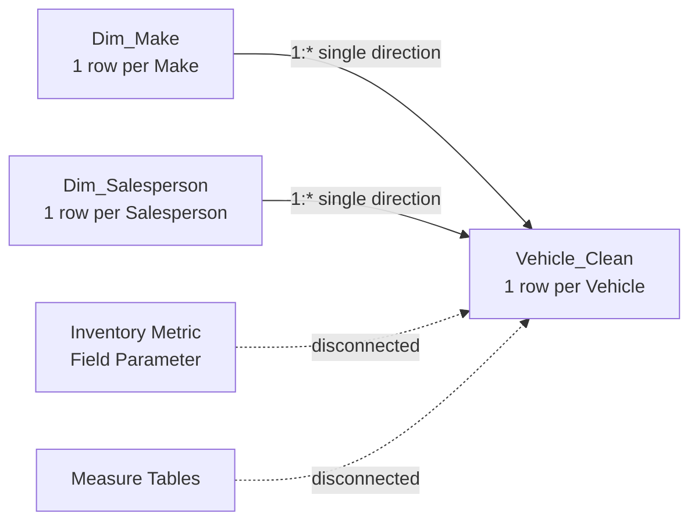

# Data Model

The report uses a lightweight star-schema pattern centered on `Vehicle_Clean`.

## Tables

### Vehicle_Clean

The vehicle-grain analytical table. It contains vehicle descriptors, numeric facts, operational flags, derived segmentation fields, and calculated business-rule fields.

### Dim_Make

A unique make list used for clean one-to-many filtering of `Vehicle_Clean`.

### Dim_Salesperson

A unique anonymized salesperson list used for clean one-to-many filtering of `Vehicle_Clean`.

### Inventory Metric

A disconnected field-parameter table that allows the Executive Overview make chart to switch among metrics such as vehicle count, inventory value, average selling price, and average mileage.

### Measure Tables

Disconnected measure-only tables organize inventory, operations, risk, dynamic-title, and tooltip measures. They are not part of the filter relationship graph.

## Modeling Decisions

- Relationships flow from dimension tables to the vehicle table using single-direction filtering.
- Helper sort columns are hidden from report consumers.
- Technical measure tables remain disconnected.
- Hidden report pages are used for tooltip and drill-through interactions rather than primary navigation.
